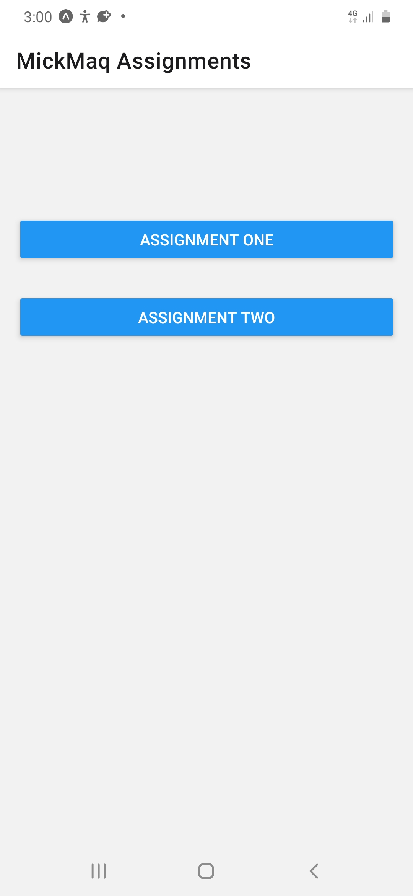
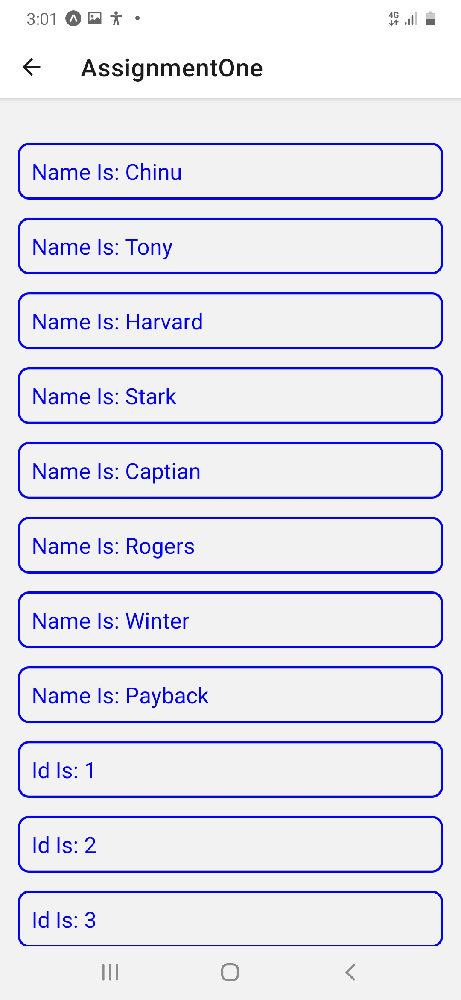
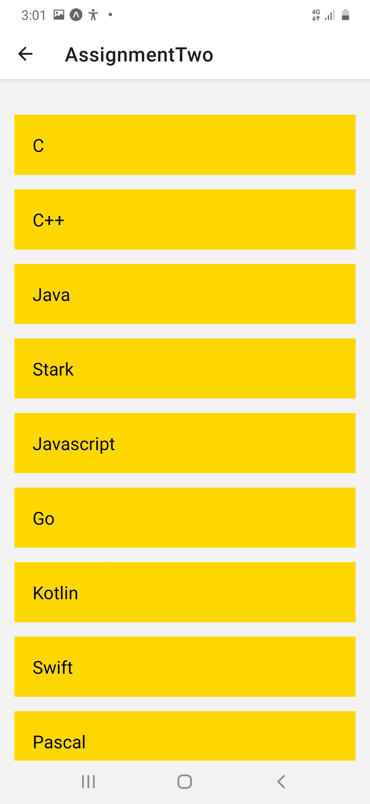

# FLATLIST ASSIGNMENT

### 1. Home Screen

The home screen contains the buttons (links) to the two exercises. This wasn't part of the assignment, but I just did it for easy access to each exercise when  running my app.

[Click here to go to home screen file](./pages/Home.js)

### 2. Assignment One

[Click here to go to Assignment One file](./pages/AssigmentOne.js)

### 3. Assignment Two

[Click here to go to Assignment Two file](./pages/AssignmentTwo.js)

