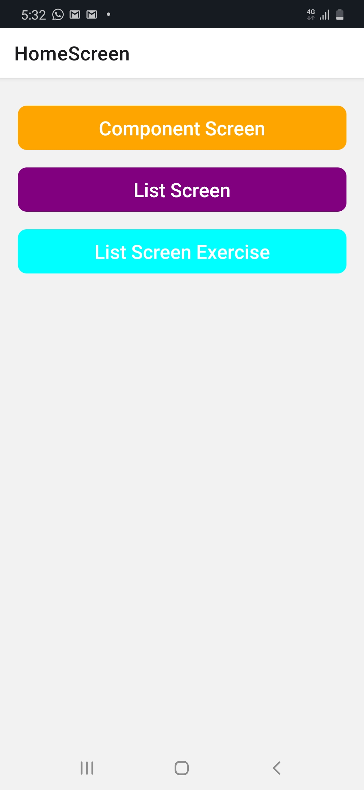
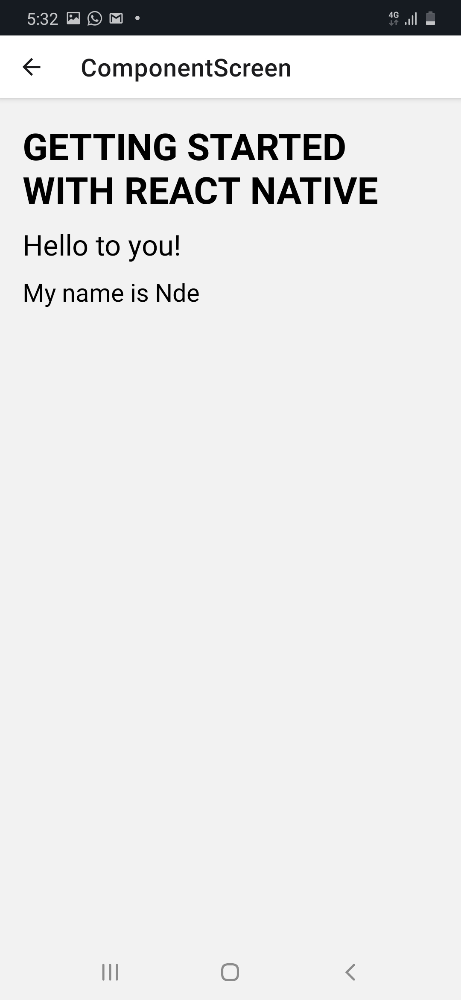
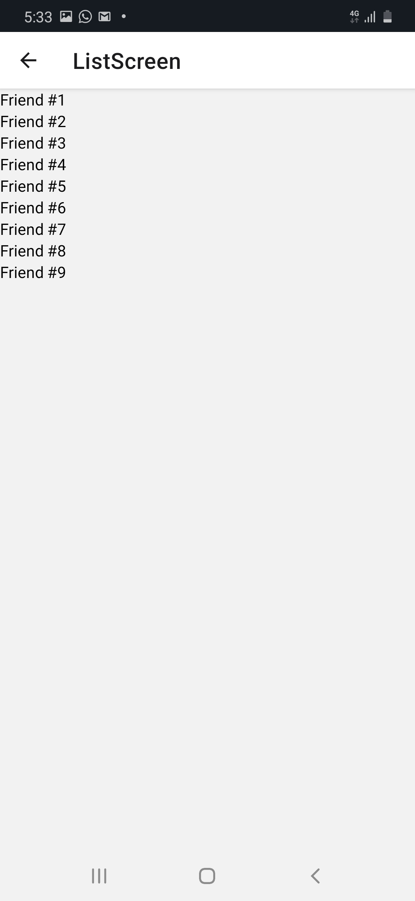
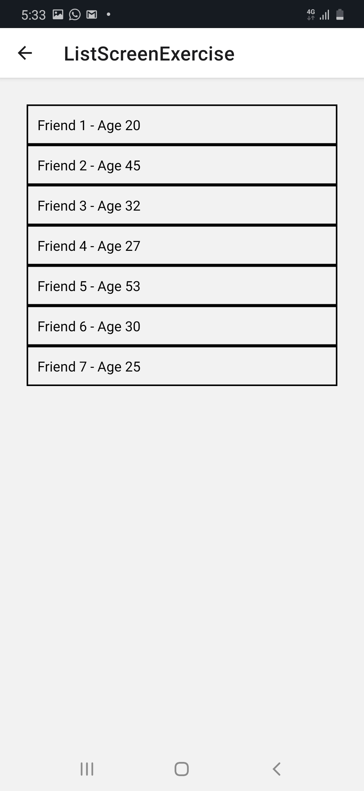

## React Native Udemy Course

For now, I've completed up to `section 3` of the course. I've done the necessary exercises also. Below are the outputs of my various screens.

#### 1. Home Screen

This screen is not found in the course, but is an additional screen added by me to easily have access to the various sections and exercises as I journey through the course. This screen takes into consideration `navigation` between the various screens.
[Click here to go to home screen file](./screens/HomeScreen.js)

#### 2. Component Screen

This screen contains a simple functional react native component. Its aim was just to give us a clear understanding of how a functional component looks like.
[Click here to go to Component file](./screens/ComponentScreen.js)

#### 3. List Screen

This screen talks about the use of `FlatList` in react native. How to pass an Array of data to a Flatlist and render it to the screen. It also takes into consideration vertical and horizontal scrolling. 
[Click here to go to List Screen file](./screens/ListScreen.js)

#### 4. List Screen Exercise

This was an exercise given at the end of `section 3` of the course. It needed us to create a vertical scrolling list of friends with their corresponding ages. 
[Click here to go to List Screen Exercise](./screens/ListScreenExercise.js)

